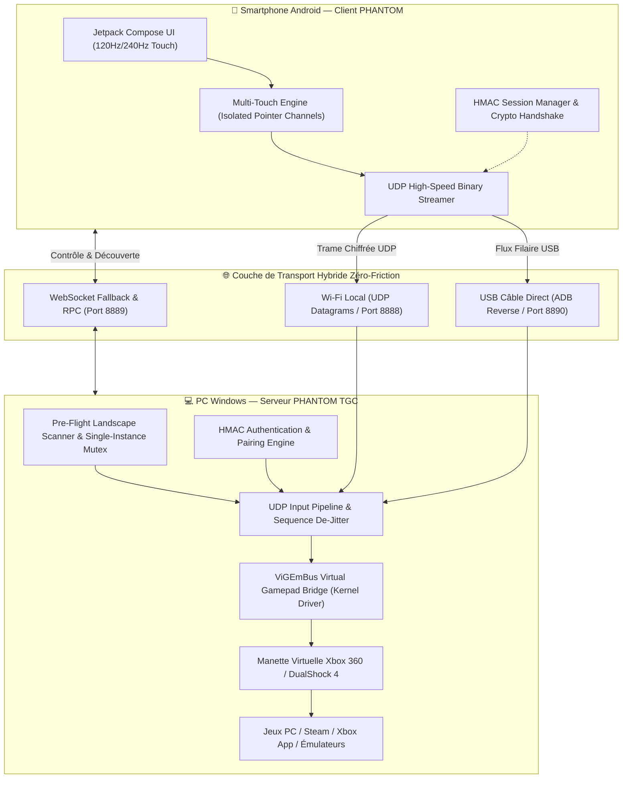

<div align="center">

# 🎮 PHANTOM
### *by The Great Corporation*

> **« The controller you don't hold, the power you command. »**  
> *L'expérience manette ultime, réinventée dans l'invisible.*

[](https://github.com/The-Great-Corporation/PHANTOM-by-The-Great-Corporation)
[](https://github.com/The-Great-Corporation/PHANTOM-by-The-Great-Corporation)
[-success?style=for-the-badge&logo=pytest)](https://github.com/The-Great-Corporation/PHANTOM-by-The-Great-Corporation)
[](https://github.com/The-Great-Corporation/PHANTOM-by-The-Great-Corporation)
[](https://github.com/ViGEm/ViGEmBus)
[](LICENSE)

---

**PHANTOM by The Great Corporation™** est le premier logiciel commercial de pointe signé **TGC**.  
Il transforme n'importe quel smartphone Android en un contrôleur de jeu de précision professionnelle pour PC Windows, Smart TV et consoles, associant ergonomie tactile chirurgicale, émulation matérielle bas-niveau native et design prestige.

*Philosophie fondatrice : **Satisfaction > Coût** — La perfection de l'expérience utilisateur avant tout.*

</div>

---

## 📑 Sommaire

1. [Vision & Philosophie](#-vision--philosophie)
2. [Piliers d'Excellence & Fonctionnalités](#-piliers-dexcellence--fonctionnalités)
3. [Architecture Système & Diagramme](#-architecture-système)
4. [Moteur Tactile & Multi-Touch Indépendant](#-moteur-tactile--multi-touch-indépendant)
5. [Installation & Démarrage Zéro-Friction](#-installation--démarrage-zéro-friction)
6. [Spécifications Techniques](#-spécifications-techniques)
7. [Garantie Qualité & Tests](#-garantie-qualité--tests)
8. [Mentions Légales & Propriété Intellectuelle](#-mentions-légales--propriété-intellectuelle)

---

## 🌟 Vision & Philosophie

Dans le jeu vidéo moderne, le contrôleur ne doit jamais faire écran entre le joueur et son immersion. **PHANTOM** a été forgé pour éliminer toute friction matérielle :
* **Aucun compromis sur la réactivité** : Un pipeline temps réel sub-milliseconde taillé pour les jeux d'action, FPS, simulateurs et compétitions.
* **Ergonomie biomécanique** : Chaque geste tactile reproduit fidèlement la sensation de retour, de trajectoire et de course des sticks et gâchettes physiques analogiques.
* **Prestige & Raffinement** : Une interface sombre et sobre, façonnée avec des micro-interactions soignées, une typographie élégante et une personnalisation infinie.

---

## ✨ Piliers d'Excellence & Fonctionnalités

### 1. Dualité des Modes : Sur-Mesure ou Autonomie Totale

| Caractéristique | 👑 Mode « The Great » (Pro Gamepad) | ⚡ Mode « Plug & Play » (Universel) |
| :--- | :--- | :--- |
| **Cible** | PC Windows (Steam, Xbox Game Pass, Émulateurs, AAA) | Smart TV, Mac, Linux, Consoles, Box TV |
| **Logiciel PC requis** | Serveur Phantom TGC (`gui_app.py` / Lanceur 1-clic) | **Aucun** (100% Autonome via Bluetooth HID natif) |
| **Transports réseau** | Wi-Fi Local (UDP sub-ms) & Câble USB (ADB Reverse zéro-latence) | Bluetooth HID Standard (Profil Manette universel) |
| **Émulation pilote** | Xbox 360 & Sony DualShock 4 via ViGEmBus Kernel | Manette Bluetooth HID conforme HID-Gamepad |
| **Contrôles spéciaux** | Mode Hybride Clavier/Souris pour jeux sans support manette | Manette standard Plug & Play |
| **Sécurité** | Appairage mutuel & Jetons cryptographiques HMAC | Appairage Bluetooth standard OS |

---

### 2. Le Studio de Configuration Haute Couture
* **Skins Authentiques Interchangeables** : Basculez en un éclair entre les thématiques visuelles légendaires :
  * *Xbox Series Edition* (Boutons colorés ABXY, dispositions asymétriques).
  * *PlayStation DualSense Edition* (Symboles Croix/Rond/Carré/Triangle, disposition symétrique).
  * *Nintendo Switch Pro Edition*.
  * *Cyberpunk Neon Edition* (Contour phosphorescent haute lisibilité).
  * *Ghost Minimalist Edition* (Épure maximale pour concentration absolue).
* **Fonds d'écran & GIFs Animés Immersifs** : Intégrez vos propres images ou GIFs animés directement depuis la galerie Android, avec réglette d'assombrissement dynamique (*alpha blending*) pour préserver une lisibilité absolue des commandes.
* **Calibration Chirurgicale** : Ajustement indépendant de la sensibilité des sticks, des courbes de réponse exponentielles et de la zone morte (*deadzone* interne et externe).

---

### 3. Quick Settings Drawer (Le Volet Escamotable En Jeu)
Ne quittez plus jamais votre partie : d'un simple balayage du pouce depuis la bordure d'écran, déployez un panneau translucide permettant de :
* Activer/désactiver à la volée le **Mode Stick Flottant vs Stick Fixe**.
* Réajuster la sensibilité et les deadzones en temps réel pendant une phase de gameplay.
* Contrôler la latence RTT (ms) et le niveau de batterie du smartphone.
* Forcer une reconnexion instantanée sans redémarrer l'application.

---

## 🏛 Architecture Système



---

## 🎯 Moteur Tactile & Multi-Touch Indépendant

La grande innovation de PHANTOM réside dans le découplage strict de chaque canal de contact tactile :

* **Isolation Pointeur par Pointeur (`pointerId`)** :
  Sur la majorité des manettes tactiles concurrentes, appuyer sur un bouton d'action (A, B, X, Y) ou presser une gâchette (LT, RT) réinitialise la boucle de détection du pouce gauche. **Sur PHANTOM, chaque doigt possède sa propre session continue.** Vous pouvez marteler les touches d'action tout en exécutant une course fluide avec le stick gauche : **zéro décrochage, zéro à-coup.**
* **Ancre Suiveuse Dynamique (*Following Anchor*)** :
  En mode flottant, lorsque le pouce franchit le rayon maximal paramétré, la base du stick glisse doucement pour accompagner la morphologie de votre main, éliminant tout sentiment de rigidité ou de perte de course.
* **Bascule Instantanée Flottant / Fixe** :
  Les joueurs attachés aux repères physiques absolus peuvent fixer la position du stick à l'écran en un clic depuis le tiroir d'options rapides.

---

## 🚀 Installation & Démarrage Zéro-Friction

### Côté Serveur (Windows PC)

Le serveur PHANTOM bénéficie d'un installeur intelligent et d'un scanner de paysage pré-vol garantissant une installation infaillible.

1. **Exécutez le script d'installation assisté** (PowerShell) :
   ```powershell
   Set-ExecutionPolicy -Scope Process -ExecutionPolicy Bypass
   .\install.ps1
   ```
   *Ce script vérifie automatiquement la version de Python, l'intégrité de l'environnement virtuel `.venv`, le pilote `ViGEmBus`, l'absence de conflit de ports (8888-8890) et crée un raccourci direct sur votre Bureau.*

2. **Lancez le serveur en 1 clic** :
   * Double-cliquez sur le raccourci créé sur votre Bureau, **ou**
   * Double-cliquez directement sur [`Lancer_Serveur_Phantom_TGC.bat`](Lancer_Serveur_Phantom_TGC.bat).

3. Cliquez sur **« DÉMARRER LE SERVEUR PHANTOM »**. Votre adresse IP locale et l'état des ports s'affichent instantanément.

---

### Côté Application Mobile (Android)

1. **Installation** :
   * Installez l'APK officiel `PHANTOM-TGC-Release.apk` sur votre smartphone Android (Android 8.0 Oreo minimum recommandé).
2. **Connexion Instantanée** :
   * Assurez-vous d'être connecté au même réseau Wi-Fi que votre PC.
   * Ouvrez l'application : le système de découverte automatique (**Auto-Discovery**) détecte votre serveur Windows sans saisie manuelle d'adresse IP.
   * Appuyez sur **▶ JOUER** : votre manette est immédiatement prête et reconnue par vos jeux.

---

## 🔬 Spécifications Techniques

| Paramètre | Spécification Officielle |
| :--- | :--- |
| **Protocole de Flux d'Inputs** | UDP binaire structuré haute performance (44 octets par frame) |
| **Protocole de Contrôle** | WebSocket JSON avec handshake asynchrone |
| **Chiffrement & Sécurité** | Jeton de session authentifié HMAC-SHA256 par échange de clé unique |
| **Fréquence d'Échantillonnage** | 120 Hz à 240 Hz natif selon l'écran tactile de l'appareil mobile |
| **Anti-Jitter & Ordonnancement** | Compteur de séquence 64-bit avec rejet des paquets périmés |
| **Pilote Émulation PC** | ViGEmBus 1.22+ (Pilote certifié WHQL Microsoft) |
| **Protection Processus Windows** | Mutex système global nommé (`Global\PhantomServerTGC_SingleInstance_Mutex`) |

---

## 🛡 Garantie Qualité & Tests

Le code source de PHANTOM applique les standards de rigueur industrielle les plus stricts :

* **Suite de Tests Serveur** : **54 tests automatisés passés avec 100 % de succès** ([`pytest server/tests`](server/tests)).
  * Validation des capacités backend (`test_backend_capabilities.py`).
  * Contrat d'émulation manette (`test_gamepad_contract.py`).
  * Scanner de paysage & détection de doublons (`test_landscape_scanner.py`).
  * Sécurité des sessions, jetons HMAC et flux UDP (`test_session_security.py`, `test_udp_security.py`).
* **Suite de Tests Mobile Android** : Tests unitaires Kotlin et assertions d'ingénierie mathématique des sticks (`StickMathTest`, `LayoutMigrationTest`).
* **Diagnostic Pré-Vol** : Analyse proactive des ports, détection du serveur de débogage Android ADB et vérification de la couche réseau avant tout démarrage.

---

## 📜 Mentions Légales & Propriété Intellectuelle

* **Éditeur & Conception** : **The Great Corporation™**
* **Auteur & Fondateur** : **Carl-William DJEGUEMA**
* **Statut Juridique** : Logiciel Commercial Propriétaire protégé par le droit d'auteur international.
* **Licence** : Soumis aux conditions d'utilisation du contrat [TGC Proprietary Commercial License (EULA)](LICENSE).
* **Marques** : *PHANTOM*, *The Great Corporation*, *TGC*, ainsi que le slogan *« The controller you don't hold, the power you command »* sont des marques déposées de The Great Corporation.
* **Pilote Tiers** : *ViGEmBus* est un projet sous licence open-source MIT/BSD développé par Nefarius Software Solutions e.U.

---

<div align="center">
  <sub>Copyright © 2026 The Great Corporation. Tous droits réservés.</sub><br>
  <b>Satisfaction > Coût.</b>
</div>
